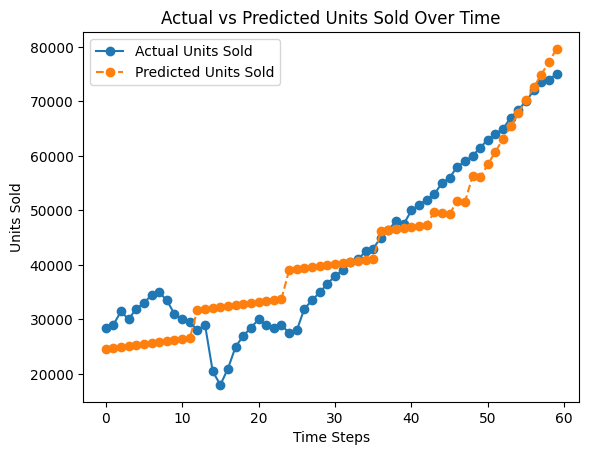

# Car Sales Prediction Analysis

This project aims to predict the number of car units sold based on key economic factors such as vehicle prices, inflation, and interest rates. The analysis uses historical data to build a predictive model, offering insights into the market dynamics of the automotive industry. The entire process, from data exploration to model evaluation, is detailed in the `Project_prediction.ipynb` Jupyter Notebook.

---

## 🖼️ Project Visualization



---

## 📋 Table of Contents

- [About the Project](#-about-the-project)
- [Tech Stack](#-tech-stack)
- [Dataset](#-dataset)
- [Project Structure](#-project-structure)
- [Getting Started](#-getting-started)
  - [Prerequisites](#prerequisites)
  - [Installation](#installation)
- [Methodology](#-methodology)
- [Results and Conclusion](#-results-and-conclusion)

---

## 📖 About the Project

The primary objective is to build a machine learning model that can accurately forecast the number of units sold in a given month/year. By understanding the relationship between car prices, inflation, interest rates, and sales volume, this model can serve as a valuable tool for manufacturers, dealerships, and market analysts for inventory planning, sales forecasting, and strategic decision-making.

### Key Goals:

- **Exploratory Data Analysis (EDA):** Analyze trends and seasonality in car sales over time.
- **Correlation Analysis:** Identify the statistical relationship between economic indicators and sales figures.
- **Predictive Modeling:** Develop and train a regression or time-series model to predict `Units Sold`.
- **Feature Importance:** Determine which factors most significantly influence car sales.

---

## 🛠️ Tech Stack

- **Language:** -   **Core Libraries:**
  - **Data Manipulation:** 
  - **Machine Learning:** 
  - **Data Visualization:**  & 
- **Development Environment:** 

---

## 💾 Dataset

The analysis is based on the `prices.csv` dataset, which contains time-series data with the following columns:

| Column                           | Description                                                                    | Data Type                 |
| -------------------------------- | ------------------------------------------------------------------------------ | ------------------------- |
| **`Month/Year`**         | The month and year of the observation (e.g.,`Jan-2022`).                     | `datetime` / `object` |
| **`New Price ($)`**      | The average price of new cars for that period.                                 | `numeric`               |
| **`Used Price ($)`**     | The average price of used cars for that period.                                | `numeric`               |
| **`Inflation Rate (%)`** | The general inflation rate for that period.                                    | `numeric`               |
| **`Interest Rate (%)`**  | The average interest rate for auto loans during that period.                   | `numeric`               |
| **`Units Sold`**         | **(Target Variable)** The total number of car units sold in that period. | `numeric`               |

---

## 📁 Project Structure

```
.
├── prices.csv                    # The raw dataset for the project
├── Project_prediction.ipynb      # Jupyter Notebook with all code and analysis
├── output.png                    # Image file for the README visualization
└── README.md                     # You are here!
```

---

## 🚀 Getting Started

Follow these instructions to set up and run the project on your local machine.

### Prerequisites

Ensure you have Python and Jupyter Notebook installed.

- Python (3.8 or newer)
- Jupyter Notebook or JupyterLab

### Installation

1. **Clone the repository:**

   ```bash
   git clone https://github.com/amineelgardoum-rgb/Prediction_Sales.git
   cd Prediction_Sales
   ```
2. **Install the required Python libraries:**
   This project relies on several common data science libraries. You can install them using `pip`.

   ```bash
   pip install pandas numpy scikit-learn matplotlib seaborn jupyter
   ```
3. **Launch the Jupyter Notebook:**
   Start Jupyter and open the main project file.

   ```bash
   jupyter notebook Project_prediction.ipynb
   ```

   This will open the notebook in your web browser, allowing you to execute the code cells and review the analysis.

---

## 🛠️ Methodology

The project follows a structured approach within the Jupyter Notebook:

1. **Data Loading and Preprocessing:** The `prices.csv` data is loaded, and the `Month/Year` column is converted to a proper datetime format to facilitate time-series analysis.
2. **Exploratory Data Analysis (EDA):** Time-series plots are used to visualize trends in sales, prices, and economic indicators. A correlation matrix is generated to understand the relationships between variables.
3. **Feature Engineering:** The `Month/Year` column is used to extract features like month, quarter, and year to capture seasonality.
4. **Model Selection and Training:** The data is split into training and testing sets. Various models are considered and trained, such as:
   - Linear Regression
   - Random Forest Regressor
   - Gradient Boosting Machines
5. **Model Evaluation:** The models are evaluated on the test set using metrics like **Mean Absolute Error (MAE)**, **Root Mean Squared Error (RMSE)**, and **R-squared (R²)** to identify the best-performing model.

---

## 📈 Results and Conclusion

- The best-performing model was **Linear Regression**, which proved effective for this dataset.
  - **R-squared (R²):** ` 0.8723459112450229`
  - **Mean Absolute Error (MAE):** ` 4629.472856634064`
  - **Root Mean Squared Error (RMSE):  `5629.228430441577`**
- The most influential factors in predicting `Units Sold` were **Used Price ($)** and **Interest Rate (%)**.
- The analysis reveals a **strong negative correlation** between interest rates and units sold, confirming the economic principle that as borrowing becomes more expensive, car sales tend to decrease.

In conclusion, the model demonstrates a strong capability to predict car sales based on the provided economic indicators. The performance of the Linear Regression model suggests that the relationships between these economic factors and car sales are largely linear, making it a simple yet powerful tool for business forecasting.
